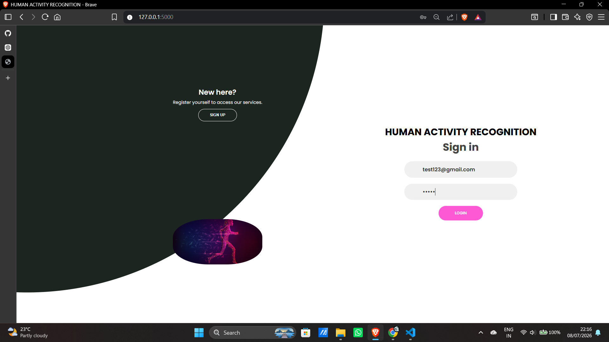
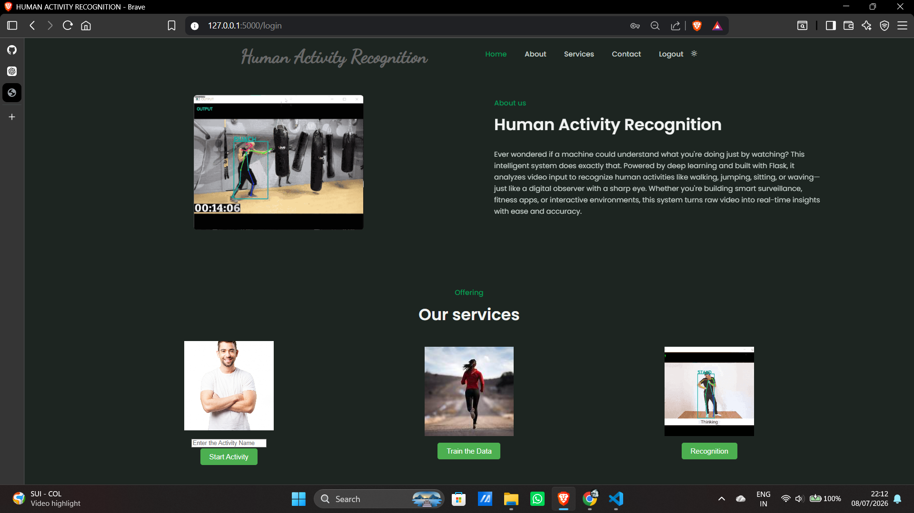

# 🏃 ActiVision AI – Real Time Human Activity Recognition Using Deep Learning

A Flask-based **Human Activity Recognition (HAR)** system that uses **computer vision** and **deep learning** to identify human activities in real time through a laptop camera.

ActiVision AI leverages **MediaPipe** for extracting human body landmarks from live video input and a trained deep learning model to classify different human activities. The system captures movement patterns, processes the extracted features, and displays the predicted activity through an interactive web-based interface.

This project demonstrates a complete AI workflow including **human pose detection, feature extraction, deep learning model training, model integration, and real-time activity prediction**.

---

# 🚀 Tech Stack

<p align="left">


</p>

---

# 📌 Key Features

- 🎥 Real-time human activity recognition using a laptop camera
- 🦴 Human pose estimation using MediaPipe
- 📍 Body landmark extraction for movement analysis
- 🧠 Deep learning-based activity classification
- ⚡ Live prediction from webcam feed
- 🌐 Flask-powered interactive web application
- 📊 Modular pipeline for data collection, training, and inference
- 💾 Trained model integration for instant predictions
- 🎯 User-friendly browser interface

---

# 🏗️ Activity Recognition Pipeline

```text
🎥 Laptop Camera / Video Input
              │
              ▼
🦴 MediaPipe Pose Detection
              │
              ▼
📍 Human Body Landmark Extraction
              │
              ▼
🧹 Feature Processing & Data Preparation
              │
              ▼
🧠 Deep Learning Classification Model
              │
              ▼
📊 Human Activity Prediction
              │
              ▼
🌐 Flask Web Application
              │
              ▼
✅ Activity Displayed to User
```

---

# 🧠 Deep Learning Workflow

ActiVision AI follows a complete machine learning pipeline for recognizing human activities.

| Stage | Description |
|--------|-------------|
| 📹 Data Collection | Captures pose landmarks using MediaPipe |
| 📍 Feature Extraction | Converts body landmarks into numerical features |
| 🧹 Data Processing | Cleans and prepares training data |
| 🧠 Model Training | Trains deep learning activity classification models |
| 💾 Model Integration | Loads trained model for inference |
| ⚡ Inference | Predicts activities from live camera input |

---

# 🧠 Model Architectures

The project experiments with several deep learning architectures.

| Model | Purpose |
|--------|---------|
| CNN | Learns spatial movement features |
| LSTM | Learns temporal relationships between frames |
| GRU | Efficient sequential learning with fewer parameters |
| RNN | Basic sequential activity modeling |
| CNN-LSTM | Combines spatial and temporal learning |

---

# ⚙️ Prediction Pipeline

```text
Live Camera Frame
        │
        ▼
MediaPipe Pose Detection
        │
        ▼
Body Landmark Extraction
        │
        ▼
Feature Vector Generation
        │
        ▼
Trained Deep Learning Model
        │
        ▼
Human Activity Classification
        │
        ▼
Real-Time Prediction Display
```

---

# ⚙️ Development Workflow

## 📌 Data Collection

- Captures live webcam frames
- Detects human pose using MediaPipe
- Extracts body landmark coordinates
- Converts movements into structured numerical data
- Stores activity samples for model training

---

## 📌 Data Processing & Feature Extraction

- Cleans collected landmark data
- Prepares activity datasets
- Converts landmarks into model-ready feature vectors
- Organizes samples by activity class

---

## 📌 Model Training

- Loads processed datasets
- Builds deep learning models
- Trains activity classification networks
- Evaluates model performance
- Saves trained model as:

```text
model.h5
```

Stores activity labels as:

```text
labels.npy
```

---

## 📌 Inference

- Loads the trained model
- Captures live webcam frames
- Extracts body landmarks
- Performs activity classification
- Displays prediction in real time

---

## 📌 Flask Web Application

The Flask backend connects the trained deep learning model with the frontend.

Responsibilities include:

- Handling routes
- Managing prediction requests
- Connecting webcam inference
- Displaying activity predictions
- Rendering the user interface

---

# 📂 Repository Structure

```text
HUMAN_ACTIVITY_FINAL/
│
├── app.py
│   └── Main Flask application
│
├── data_collection.py
│   └── Pose landmark data collection
│
├── data_training.py
│   └── Data preprocessing and model training
│
├── inference.py
│   └── Real-time activity prediction
│
├── model.h5
│   └── Trained deep learning model
│
├── labels.npy
│   └── Activity labels
│
├── requirements.txt
│
├── templates/
│   ├── home.html
│   └── login.html
│
├── static/
│   ├── bg.jpg
│   └── styles/
│
├── Snapshots/
│
└── README.md
```

---

# ▶️ Getting Started

## 1️⃣ Clone the Repository

```bash
git clone https://github.com/IgrisViOverlord-10/laughing-dollop.git
```

Move into the project directory:

```bash
cd HUMAN_ACTIVITY_FINAL
```

---

## 2️⃣ Create a Virtual Environment

```bash
python -m venv venv
```

---

## 3️⃣ Activate the Virtual Environment

### Windows

```bash
venv\Scripts\activate
```

After activation:

```text
(venv) C:\Users\User\HUMAN_ACTIVITY_FINAL>
```

---

## 4️⃣ Install Dependencies

```bash
pip install -r requirements.txt
```

---

## 5️⃣ Run the Flask Application

```bash
python app.py
```

---

## 6️⃣ Open the Application

Visit:

```text
http://127.0.0.1:5000/
```

The browser will open the ActiVision AI application and begin real-time activity recognition using your laptop camera.

---

# 📸 Project Snapshots

| Screenshot | Description |
|------------|-------------|
|  | Login Page |
|  | Home Dashboard |
|  | Real-Time Activity Prediction |

---

# 💡 Skills Demonstrated

- Deep Learning
- Computer Vision
- Human Pose Estimation
- MediaPipe
- OpenCV
- TensorFlow & Keras
- Sequential Deep Learning Models
- Flask Web Development
- Feature Engineering
- Dataset Preparation
- Real-Time Video Processing
- AI Model Deployment
- Backend & Frontend Integration

---

# 🚀 Future Improvements

- Support additional activity classes
- Improve accuracy with larger datasets
- Implement Transformer-based architectures
- Enhance low-light detection
- Handle partial body occlusion
- Deploy on cloud platforms
- Develop a mobile application
- Optimize for edge devices
- Add activity history and analytics
- Integrate Explainable AI (XAI)

---

# 📝 Project Note

> **ActiVision AI** was developed as a final-year academic project to demonstrate the practical implementation of **Deep Learning**, **Computer Vision**, **Human Pose Estimation**, and **Real-Time Human Activity Recognition** using a Flask-based web application.

The project showcases the complete AI development lifecycle—from collecting human movement data and training deep learning models to deploying a real-time activity recognition system powered by a laptop camera.

---

# ⭐ If You Like This Project

If you found this project useful, consider giving it a ⭐ on GitHub to support the project.
